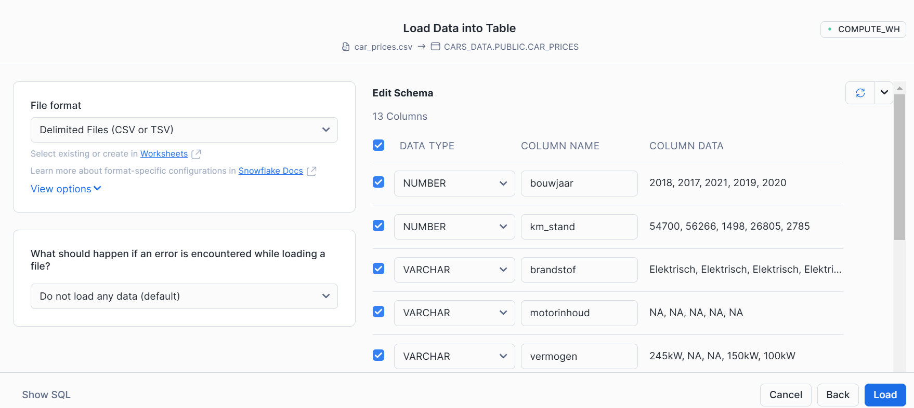

# Demo snowflake notebook on snowpark ML

## Intro

This repo contains some info, a data set and a notebook demonstrating the use of [snowpark ML](https://docs.snowflake.com/en/developer-guide/snowflake-ml/overview). We'll train a machine learning model using a snowpark ML pipeline and register that pipeline in the snowpark model registery. The model can then be used for scoring new data.

## Setup account

If you don't have a snowflake account yet, it is easy create a [trial account](https://signup.snowflake.com/?trial=student). You should have 120 days and 400 credits to do some experimention.


## Create database objects

Lets create a new database called 'CARS_DATA'. 
1. Click on the '+ CREATE' button 
2. Select SQL worksheet 
3. In that new worksheet type in and run:

```sql
CREATE DATABASE CARS_DATA;
```


## Upload Data

Now that we have a database, we can populate it with tables, one way is to upload data. To upload the `car_prices.csv` dataset, you can use the Snowflake web interface. Below is an example of how to upload the data using the Snowflake web interface:

1. Navigate to the Data > Databases section,
2. Select the `CARS_DATA` database that we just created.
3. Select the `PUBLIC` schema,
3. Click on the CRAETE button and select Table from file.
4. Use the "Load Data" option to upload the `car_prices.csv` file.

Here are some screenshot of the upload process:




When the data is uploaded you can view the car_price data in the snowflake interface


## Notebook

We can now upload the carprice_prediction_snowflake_notebook in this repository to snowflake. From the snowflake homepage:
1. Click + Create
2. Select Notebookk > Import *.ipynb file 


### Packages
The notebook makes use of the `plotly` and the `snowflake-ml-python` packages we need to enter those in the package list of the notebook first.


